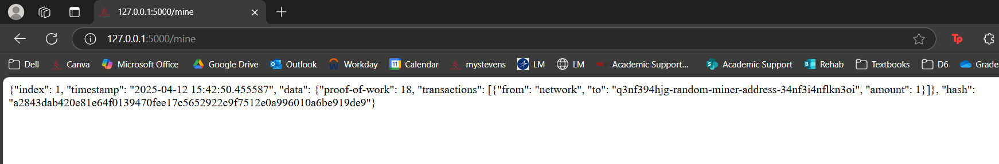

# Lab 9 - Blockchain

## hash_value.py
### First part of this lab was to run hash_value.py twice
### First I ran `cat hash_value.py` which showed the file contents before running the program. 

### This program was used to generate hash values for several different variables. It can be seen that hash for 1, 1.0 and 3.14 stayed the same through both runs the others changed for each run.

## Running snakecoin.py
### Next part of the lab ws to run snakecoin.py by running the following commands. The cat command allowed me to view the file contents before running the program.

### The purpose of `snakecoin.py`  is to build a small blockchain using python.

## Running snakecoin-server-full-code.py
### In order to run the SnakeCoin server I ran the following commands in the terminal

### The following is what was seen at [http://127.0.0.1:5000/](http://127.0.0.1:5000/) 

### Then I ran the following in a seperate terminal :
#### `curl "localhost:5000/txion" \`
#### `-H "Content-Type: application/json" \`
#### `-d '{"from": "akjflw", "to":"fjlakdj", "amount": 3}'`
#### `curl localhost:5000/mine`
### The following was seen at [http://127.0.0.1:5000/mine](http://127.0.0.1:5000/mine) which created a transaction and mined a new block 

## Python BLockchain app
### In terminal 1 I ran the following commands :
#### `git clone https://github.com/satwikkansal/python_blockchain_app.git`
#### `cd ~/python_blockchain_app~
#### `nano node_server.py`
#### `python3 node_server.py`

### In terminal 2 I ran the following commands :
#### `cd ~/python_blockchain_app`
#### `python3 run_app.py`

### I then went to [http://127.0.0.1:5000/](http://127.0.0.1:5000/) which is shown below :

### I posted to the app (Block #1) and request to mine. Then going to [http://127.0.0.1:8000/mine](http://127.0.0.1:8000/mine) which showed the following :

### Then finally, I went back to the main page and pressed "Resync" to see my updated changes to my blockchain : 

