# Lab 2

## hostname
This command shows the computer's network host name
## env
This command displays the computer's environment variables 
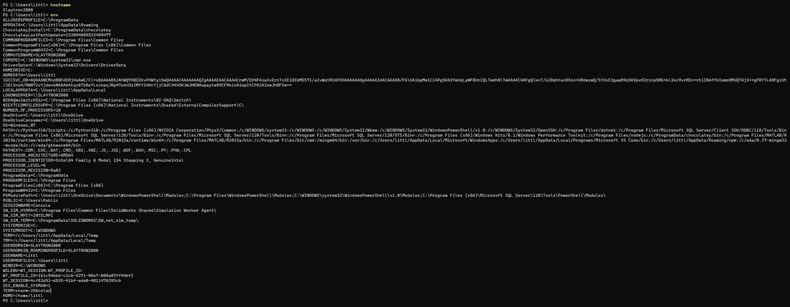

## ps
This line shows information about processes running on the computer
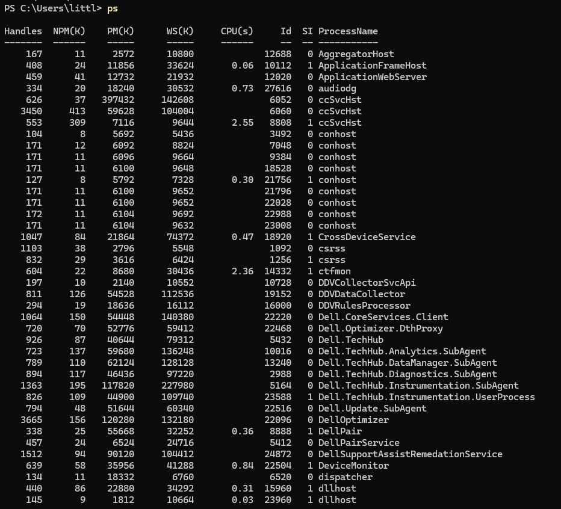

## pwd
This line displays the path of the current directory you are in

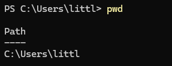

## git clone
This command makes a copy of the git repositiory that is located at the specific website in the command
## cd iot
This line changes the working directory to IOT
## ls
This command shows all the files that are in the current directory you are in
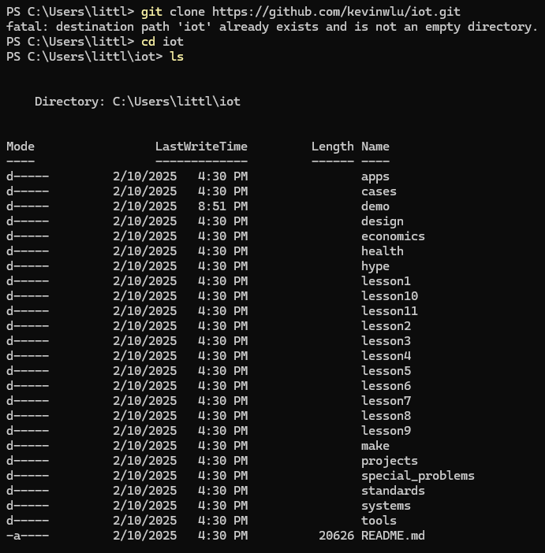

## cd
This line will change your current directory to your home directory
## df
This command shows information regarding the disk space on the file system
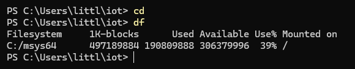

## mkdir demo
This line creates a new directory called demo
## cd demo
This command changes your current directory to demo
## nano file
This line will open a blank text editor where you can type to add and edit the file because a file named 'file' doesn't exist yet. These changes will be saved into a file named 'file'. I wrote *smelly cat* in the file
## cat file
This command displays the contents of 'file'

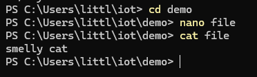

## cp file file1
This command copies the contents of file into file1
## mv file file2
This command moves(renames) file to file2
## rm file2
This command deletes file2

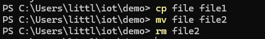

## clear
This command clears all contents from the terminal screen
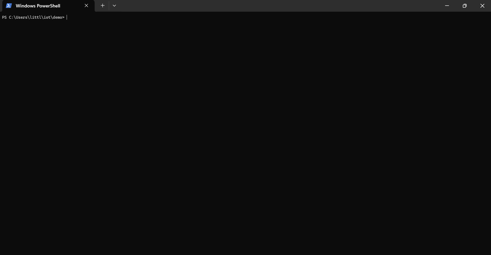

## ifconfig
This command displays a comprehensive list of all network interfaces on a system, displaying relevant details such as their respective IP addresses, MAC addresses, network masks, and other associated configuration information

This is the error I was getting I tried to troubleshoot but couldn't get the command to work :
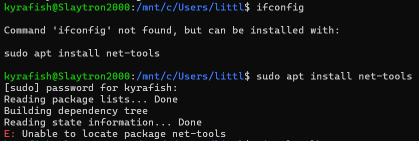

This is what I should've gotten if the command ran properly :
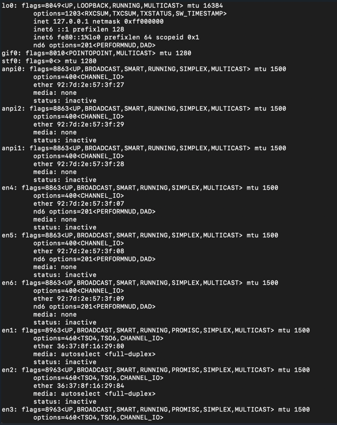
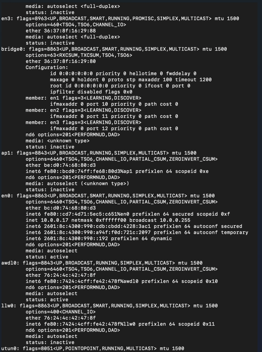
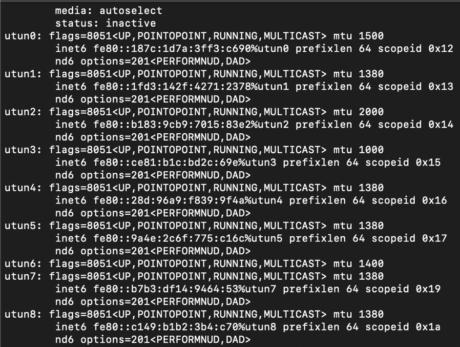

## ping localhost
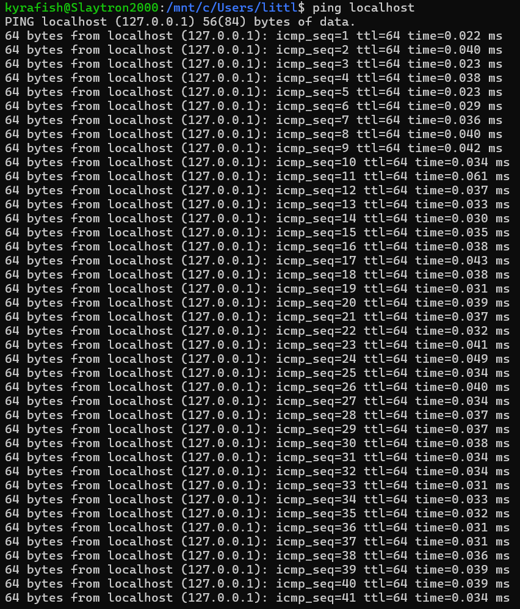
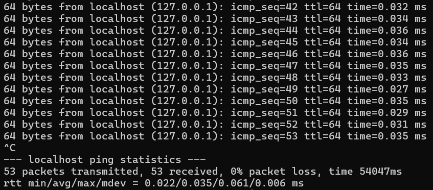

## netstat
This command provides information about network connections, routing tables, interface statistics, and more. It helps in monitoring network activity and diagnosing network issues on a system.

This is the error I was getting I tried to troubleshoot but couldn't get the command to work :
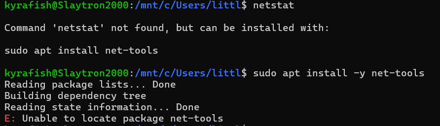

This is what I should've gotten if the command ran properly :

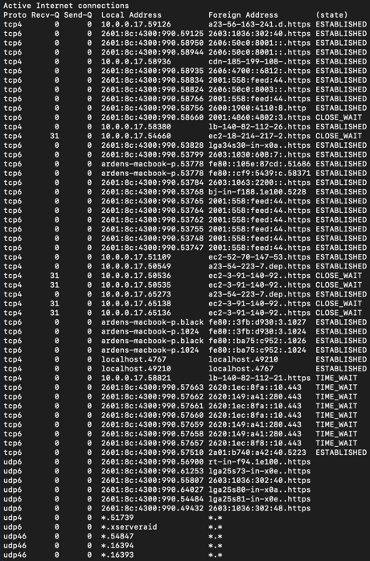
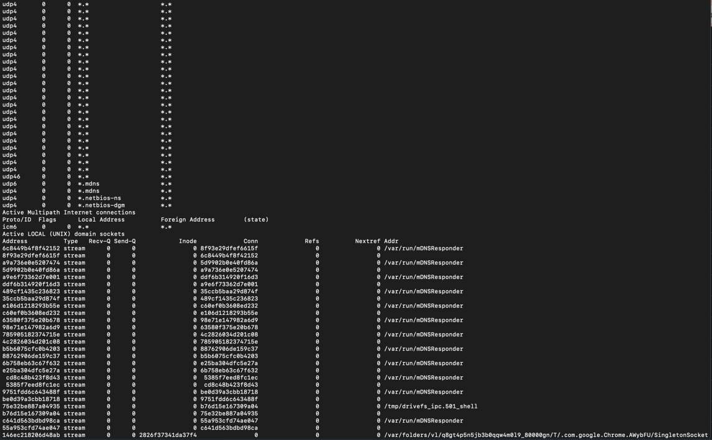
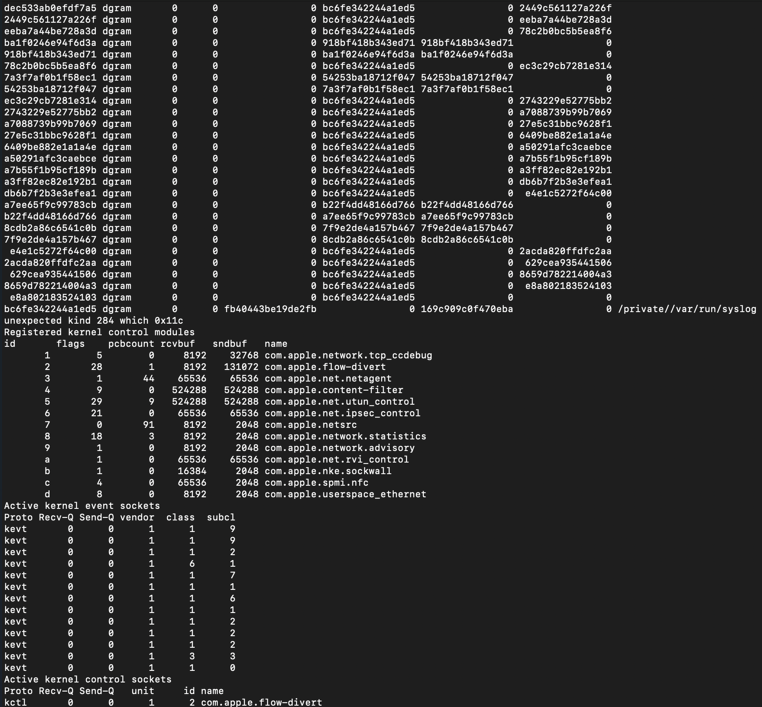
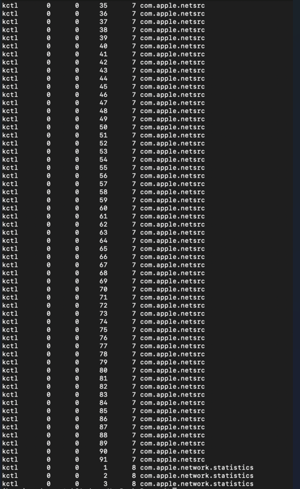

