# Lab 3
## Python 

### Installing Necessary Python Packages
#### Before executing the python code I installed jdcal, astral and geopy. I ran the following commands: 
#### `pip3 install jdcal`, `pip3 install astral`, `pip3 install geopy`

---
### cd ~/iot
#### This command moves directories to iot
### cd *3
#### This command changes directories to the first directory within iot that has a 3 in its name: "lesson3"
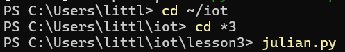
---
### .\julian.py
#### This command runs the python script called julian.py and shows the calendar date, Julian date and modified Julian date.
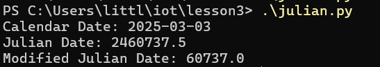
---
### .\date_example.py
#### This command runs the python script titled date_example.py and shows the current date formated in several ways as well as calculating the number of days since the first day of classes and until the last day of classes.
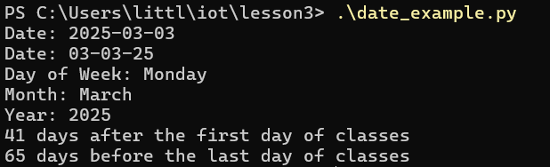
---
### .\time_example.py
#### This command runs the python script called time_example.py which prints the current local time every 10 seconds until interrupted you can stop this by pressing Ctrl C
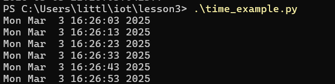
---
### .\sun.py "New York"
#### This command runs the pythin script titled sun.py which takes in the city (in this example New York) and gives data about the sun such as dawn, sunrise, noon, sunset and dusk
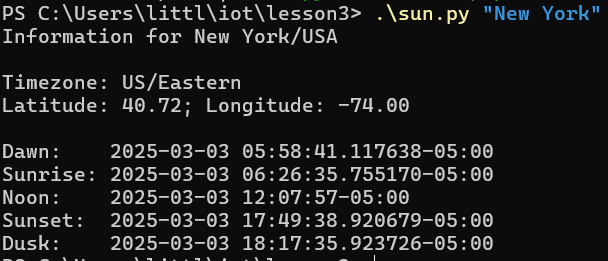
---
### .\moon.py
#### This command runs the python script called moon.py which prints the phases of the moon for the next 30 days starting with the current day
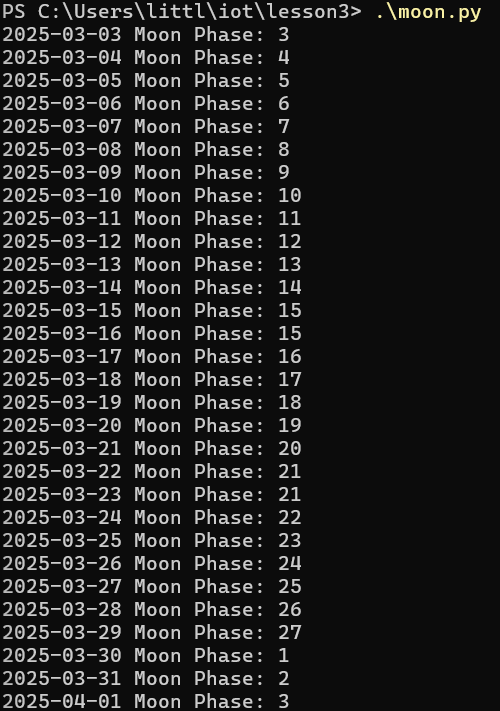
---
### .\coordinates.py "Samuel C. Williams Library"
#### This command runs the python script titled coordinates which takes in an address/landmark and uses the geopy library to find the locations geographical coordinates. Then it prints the full address of the location along with its latitiude and longitude
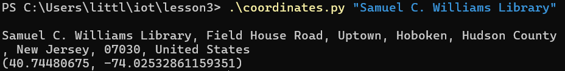
---
### .\address.py "40.74480675, -74.02532861159351"
#### This command runs the python script called address.py which takes in coordinates and uses the geopy library to find the cooresponding address and prints the full address along with its latitude and longitude
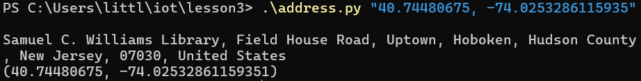
---
### .\cpu.py
#### This command runs a python script called cpu.py it displays the number of physical and logical CPU cores and then shows the CPU utilization percentages for each cooresponding core every second for 10 seconds
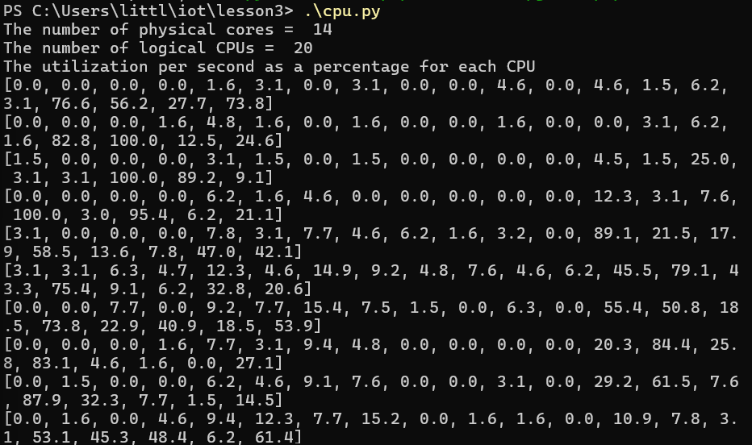
---
### .\battery.py
#### This command runs a python script called battery.py which prints the current battery status such as percentage, seconds left and if the computer is plugged in or not
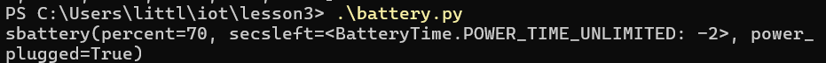
---
### .\documentstats.py document.txt
#### This command runs a python script titled documentstats.py which reads a text file (in this example document.txt) and counts the number of occurences of words excluding common stop words. THen it prints the total word count along with the top ten most frequent words and their frequency.
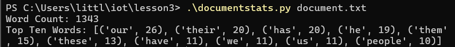
