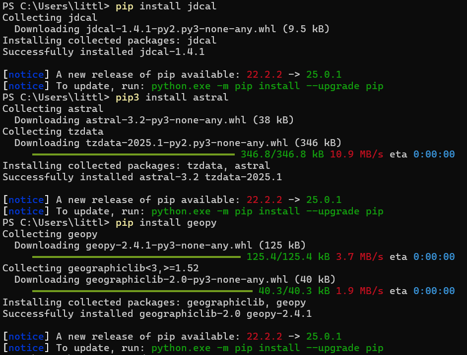
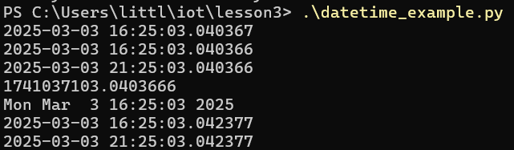

# Lab 3
## Python 

### Installing Necessary Python Packages
#### Before executing the python code I installed jdcal, astral and geopy. I ran the following commands: 
#### `pip3 install jdcal`, `pip3 install astral`, `pip3 install geopy`.

---
### cd ~/iot
#### This command moves directories to iot
### cd *3
#### This command changes directories to the first directory within iot that has a 3 in its name: "lesson3"

---
### .\julian.py
#### This command runs the python script called julian.py and shows the calendar date, Julian date and modified Julian date.

---
### .\date_example.py
#### This command runs the python script titled date_example.py and shows the current date formated in several ways as well as calculating the number of days since the first day of classes and until the last day of classes.

---
### .\daytime_example.py
#### This command

---
### .\time_example.py
#### This command

---
### .\sun.py "New York"
#### This command

### .\moon.py
This command

### .\coordinates.py "Samuel C. Williams Library"
This command

### .\address.py "40.74480675, -74.02532861159351"
This command

### .\cpu.py
This command

### .\battery.py
This command

### .\documentstats.py document.txt
This command

