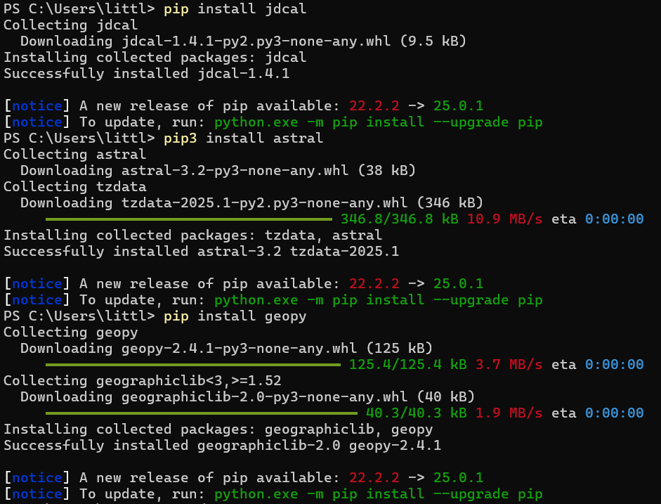

# Lab 4
##  Django and Flask

### Installing Django and REST framework
#### The following commands were executed in my terminal to install Django and Django REST framework:
#### `pip3 install -U setuptools', 'pip3 install -U django', 'pip3 install -U djangorestframework', 'pip3 install -U django-filter', 'pip3 install -U markdown', 'pip3 install -U requests'

