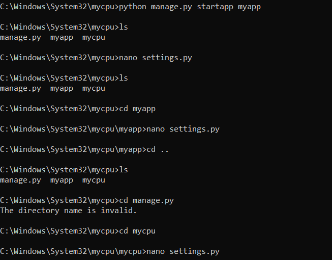

# Lab 4
#  Django and Flask

## Installing Django and REST framework
### The following commands were executed in my terminal to install Django and Django REST framework:
#### `pip3 install -U setuptools`, `pip3 install -U django`, `pip3 install -U djangorestframework`, `pip3 install -U django-filter`, `pip3 install -U markdown`, `pip3 install -U requests`

### `django-admin startproject stevens` 
#### This started a Django project named "stevens" 

### `python3 manage.py startapp myapp`
#### This started a Django app named "myapp" 

### `python3 manage.py migrate`
#### I started the app and then this allowed me to mirgrate the database and ensure SQLite was set up 

### `nano settings.py`
#### This allowed me to edit settings.py in ~/stevens/stevens to add an asterisk to ALLOWED_HOSTS and 'myapp' to INSTALLED_APPS

### `cp ~/iot/lesson4/stevens/urls.py .`
#### This copied urls.py to ~/stevens/stevens

### `cp ~/iot/lesson4/stevens/admin.py .`, `cp ~/iot/lesson4/stevens/models.py .`, `cp ~/iot/lesson4/stevens/views.py .`
#### This copied admin.py, models.py and views.py to ~/stevens/myapp

### `mkdir static templates`, `cd templates`, `mkdir myapp`, `cd myapp`, `cp ~/iot/lesson4/stevens/index.html .`
#### This copied index.html

### `nano index.html`
#### This this allowed me to replaced "YOUR_API_KEY" in index.html with the API key which enabled google maps API. To do this, I obtained an API key from the google cloud console. 

### `cp ~/iot/lesson4/static/favicon.ico .`, `mkdir myapp`, `cd myapp`, `cp ~/iot/lesson4/static/*css .`, `cp ~/iot/lesson4/static/*js .`
#### This allowed me to copy static files from the GitHub repository. I was having errors when running these commands but it should have allowed me to copy these files

### `python3 manage.py makemigrations myapp`, `python3 manage.py migrate` 
#### This allowed me to update the database before running the server

### `python3 manage.py runserver`

#### I went to http://127.0.0.1:8000/admin and signed in. I added in  date/time, temperature, longitude, and latitude and saved. Then I went to the Django app by going to http://127.0.0.1:8000. I was getting errors when trying to run this but this was the results I should have gotten.

### The app is shown below:

## Django REST project
### To start this part of the lab I started a Django project titled stevens by executing
#### `django-admin startproject stevens` and `python3 manage.py startapp myapp`

### Then I edited settings.py in /mycpu/myapp to the following :

### Then I copied urls.py, admin.py, models.py, views.py and serializers.py to /mycpu/mycpu
### by running the following commands : 
#### - `cp ~/iot/lesson4/mycpu/admin.py .`
#### - `cp ~/iot/lesson4/mycpu/models.py .`
#### - `cp ~/iot/lesson4/mycpu/views.py .`
#### - `cp ~/iot/lesson4/mycpu/serializers.py .`

### Once those were copied I changed my passord in views.py by running `nano views.py` 

### Then I created a few new files and copied index.html by running `cp ~/iot/lesson4/mycpu/index.html .`

### Next I copied the static files by executing 1cp ~/iot/lesson4/static/*css .` and `cp ~/iot/lesson4/static/*js .`

### Then I changed switched back to mycpu and copied controller.py by running `cp ~/iot/lesson4/mycpu/controller.py`. Then changed the password by using `nano controller.py.`. Additionally I also installed psutil by running `pip3 install -U psutil`. 

### Then I ran `python3 manage.py makemigrations myapp`, `python3 manage.py migrate` and `python3 manage.py createsuperuser`. This was giving me some issues I wasn't able to open the actual app but this is what it should have looked like.

## Running Flask Server
### I had previously installed Flask therefore all I had to run was `cd ~/iot/lesson4` and `python3 hello_world.py`

### Once running I went to the server at http://127.0.0.1:5000/.

