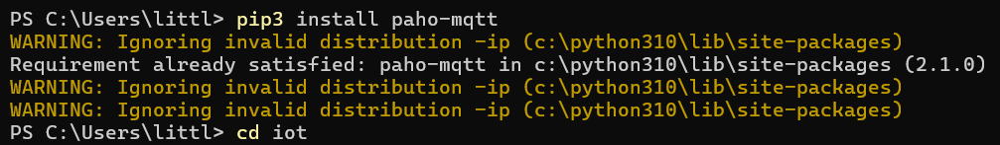
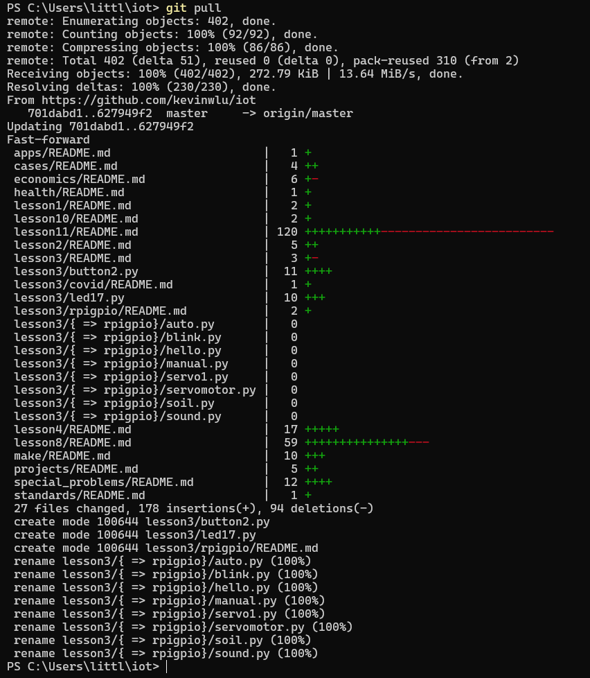
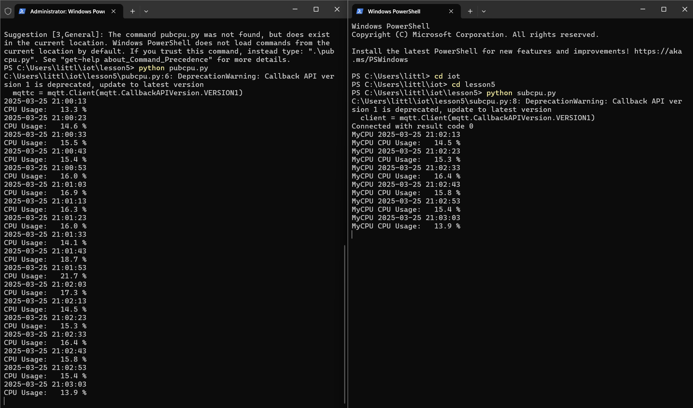

# Lab 5
#  Paho-MQTT

## Installing Paho-MQTT
### First step of this lab was to install Paho-MQTT using similar processes from previous labs of using pip3.

### I then `cd iot` and `git pull` to make sure my repo was updated to the most recent files that were needed for this lab

### Next I opened two command window terminals. On each I ran a different line : 
#### - the first script was `pubcpu.py` which published the system's current CPU utilization to the MQTT network periodically
#### - the second line was `subcpu.py` which connected to the MQTT network and subscribed to the CPU data published by the first terminal. This was shown working because after the CPU data was published in terminal 1 it was then published moments later in terminal 2

