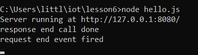

# Lab 6
#  Node.js and Pystache

## Installing Node
### First step of this lab was to install Node by downloading the window installer from its website and running it 

## Installing Pystache
### Then I needed install Pystache using similar processes from previous labs of using pip3 and navigating into iot and lesson6 before downloading

## Node.js
### The first task of this lab was to run several Javascript files on a web server using Node.js
### 1. `node hello-world.js`

### Giving these results :

### 2. `node hello.js`

### Giving these results :

### 3. `node http.js`
#### This created a webpage that displayed the number of times the page has been refreshed and the terminal printed this number as well. 

### Giving these results :

## Pystache
### The second task of this lab was to use the script called Pystache which was installed earlier in this lab to better understand its function
### By executing the `say_hello.py` script 
#### Pystache allows for the substitution of variables within the template with data from a list, resulting in personalized output strings beginning with "Hey." 

