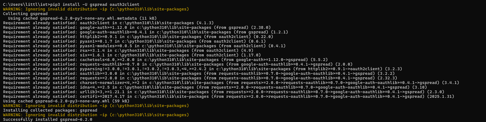
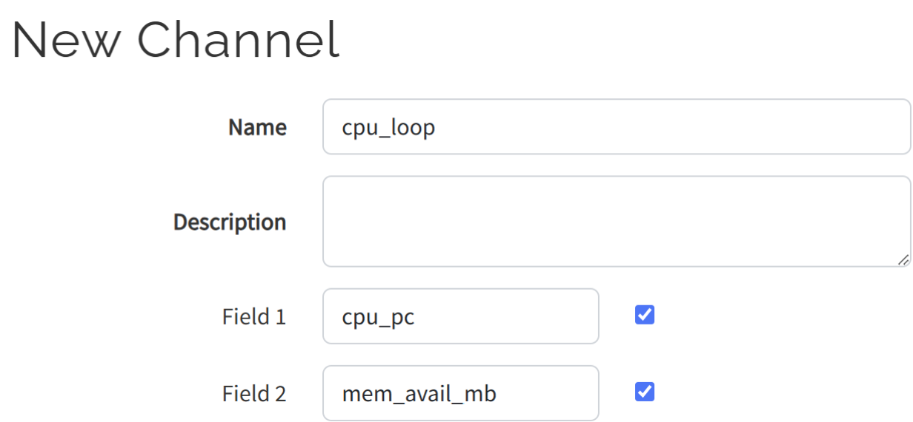
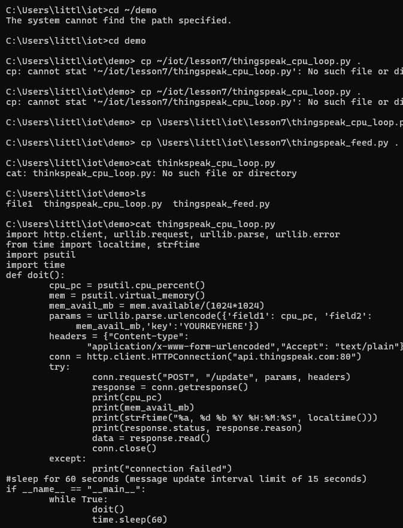
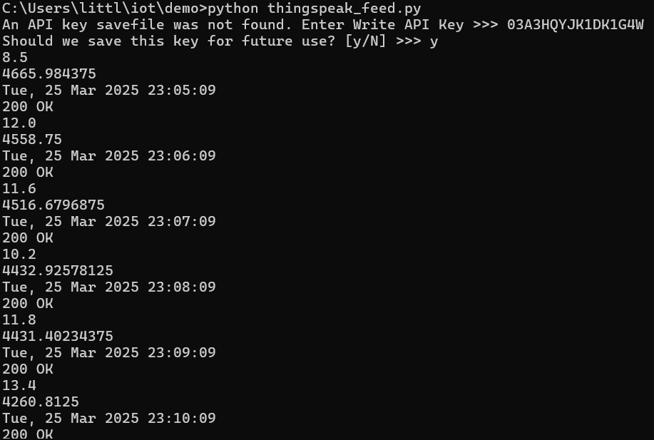
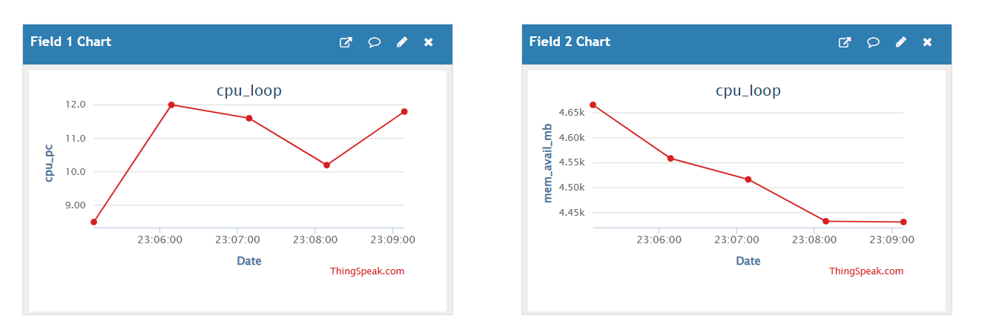
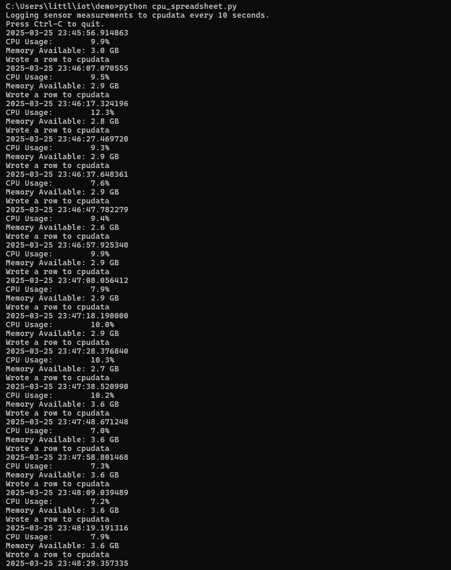
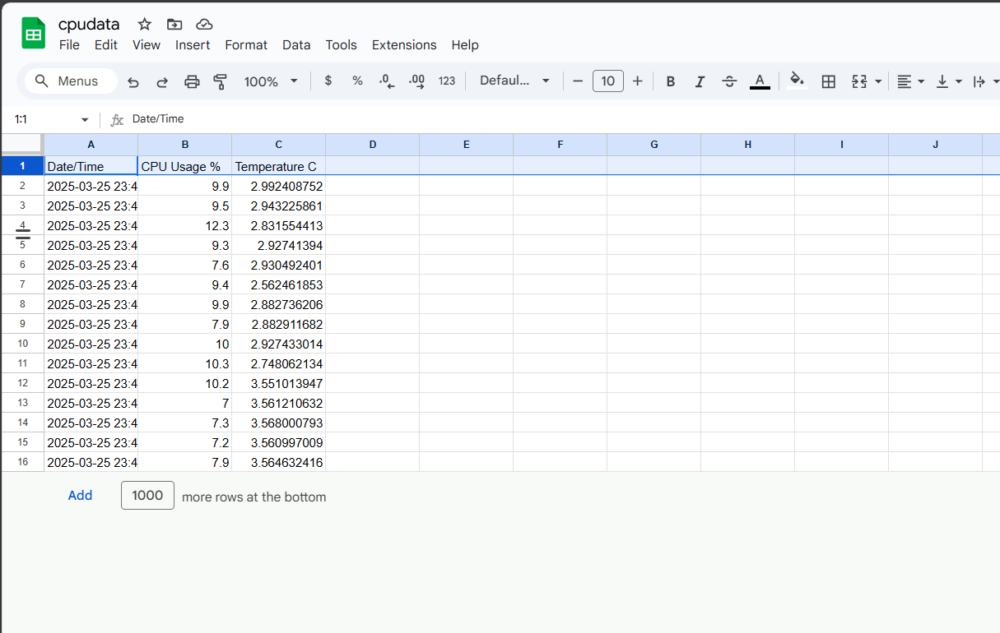

# Lab 7
#  ThingSpeak and Google Sheets

## Installation
### First step of this lab was to install oauth2client for the Google Sheets portion it was installed using pip like the previous packages

## ThingSpeak
### I opened up my MathWorks account and went into ThingSpeak. Once there I created a new channel called "cpu_loop" and labeled the first two field "cpu_pc" and them "mem_avail_mb"

### I then saved the channel and went into API Keys tab and copied the Write API Key

### Then I ran the following code to run `thingspeak_feed.py`

### After running `python thingspeak_feed.py` the terminal asked me to enter the Write API Key. I pasted the Key that I compied from ThingSpeak and then replied y for yes to save the key for future use

### Once the key was entered `thingspeak_feed.py` began to run

## Google Sheets/Google Cloud Patform
### The first step I took was to create a new Google Cloud project titled "cpudata". I could then enable the API Keys for Google Drive and Google Sheets.The service account keys were downloaded as a `.json` file and r`pi_spreadsheet.py` were copied to demo
### I then created a Google Sheet called "cpudata", deleted all rows except the first row, added headers to the columns and shared the sheet with an email address linked to the key `.json` file. This allowed the account edit access to the sheet.
### I then ran `cpu_spreadsheet.py` from the demo directory. It began gathering, printing, and uploading system CPU usage and memory data. This data was then written into the cpudata spreadsheet in new rows by the program through the Google Cloud API.

### After all that I ran `python cpu_spreadsheet.py` and this starting printing in my terminal 

### The same information then started printing into my Google Sheet

