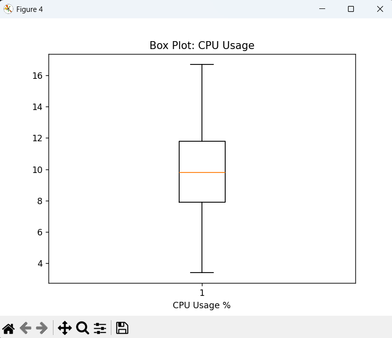

# Lab 8 - Data Analysis

## Installation
#### First step of this lab was to install the needed python packages it was installed using pip like the previous packages

## Testing 
#### To make sure the packages were working I ran `titanic_1.py` which analyzed the data set of Titanic survivors, printed the percentages of surviving female and male passengers, and generated a graph showing the number of passengers in each class

#### Also ran `titanic_2.py` which analyzed the same data set, but analyzed the percentages of survivors from female and male categories, while also sorting those categories into classes and fare subclasses from those classes

## Data Analysis
#### Next I downloaded my Google Sheet from Lab 7 called "cpudata" as a .csv file and then moved it into ~/demo folder. 
#### After doing so I ran the following commands: `cd ~/demo` `cp ~/iot/lesson8/plt_final.py` `cp ~/iot/lesson8/plt_cv2.py` `nano plt_final.py` and `nano plt_cv2.py`

#### When running nano commands it was used to change the Python scripts to fit my data. I changed plot titles, axis titles, and file name (cpudata.csv). In lab 7 the data recorded was CPU Usage and Memory Available instead of CPU Usage and Temperature.

### updated `plt_final.py`:

### updated `plt_cv2.py`:

#### After these files were edited I could run 
### `python plt_final.py`
### `python plt_cv2.py`
#### This resulted in 7 plots which gave me vision representation of the data previously collected regard CPU Usage and Memory Available on my Dell

## Time Series Plot:

## Histogram Plots:

## Box Plots:

## Scatter Plot:

## Cross-Validation Plot:

