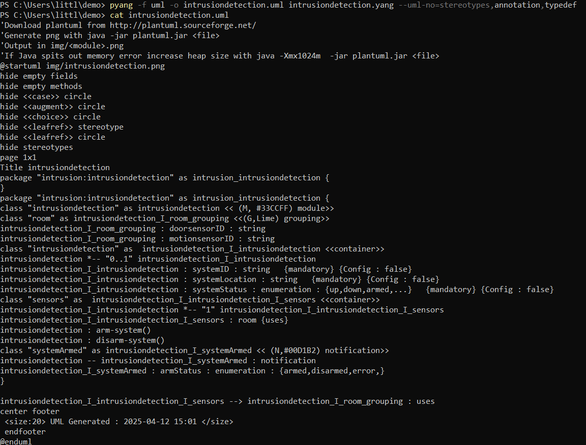

# Lab 9 - YANG

## Installation
#### First step of this lab was to install the needed python packages it was installed using pip like the previous packages

## Pyang
#### Then I copied intrusiondetection.yang into demo and moved to the demo directory

#### I then executed the following commands to create `intrusiondetection.yin` and `intrusiondetection.uml` version of it in .yang, .yin, and .uml forms
#### `cat intrusiondetection.yang`
#### `pyang -f yin -o intrusiondetection.yin intrusiondetection.yang`
#### `cat intrusiondetection.yin`
#### `pyang -f uml -o intrusiondetection.uml intrusiondetection.yang --uml-no=stereotypes,annotation,typedef`
#### `cat intrusiondetection.uml`

## PlantUML
#### I then ran the command `python3 -m plantuml intrusiondetection.uml` to create a diagram in PNG format. Then I installed and ran GIMP and Pinta in order to view the PNG file

## PNG Image Result

