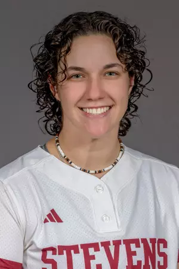

# Kyra Fischer

[Kyra Fischer GitHub](https://github.com/kyrafish7/EE322)
> “Failure is only the opportunity to begin again, only this time more wisely.” - Henry Ford
## Stevens Institute of Technology 2026
### *Bachelor of Engineering Electrical Engineering*
**Current Courses**
 
1. Digital Signal Processing
2. Control Systems 
3. Smart Grid
4. Engineering Design VI
5. Project Management & Organizational Design
---
**Extracurriculars** 
- Society of Women Engineers
- Softball 
- IEEE (Eta Kappa Nu)
---
**Experience**
- ENGR 245 TA
   
  `Fall 2024`
- College Student Tech Sr at Lockheed Martin
   
  `Summer 2024 - Created GUI in MATLAB`
- Co-op Technical at Lockheed Martin
   
  `Summer 2023 - Ran latency testing using MATLAB/Excel`

